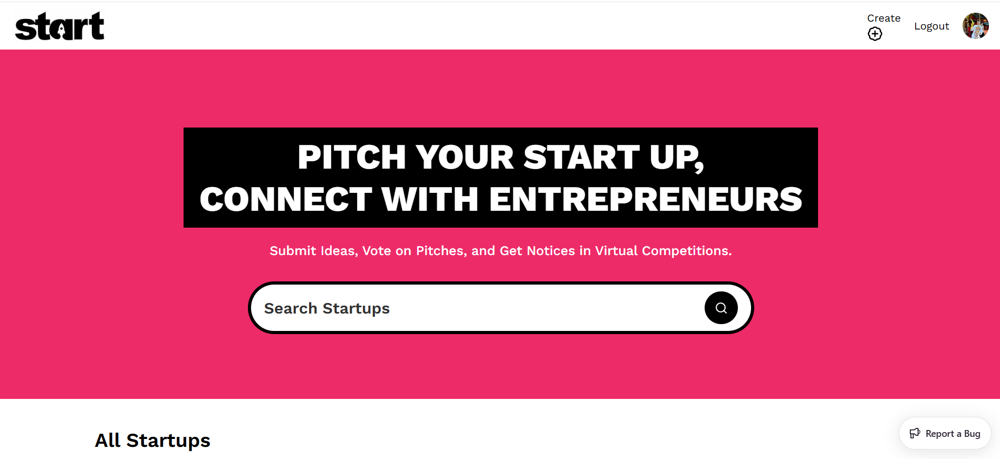

## 🤖 Project Overview


This is a Next.js 15 platform where entrepreneurs can submit their startup ideas for virtual pitch competitions, browse other pitches, and gain exposure through a clean minimalistic design for a smooth user experience.

## ⚙️ Tech Stack

* React 19
* Next.js 15
* Sanity
* TailwindCSS
* ShadCN
* TypeScript

## 🔋 Features

👉 **Live Content API**: Displays the latest startup ideas dynamically on the homepage using Sanity's Content API.

👉 **GitHub Authentication**: Allows users to log in easily using their GitHub account.

👉 **Pitch Submission**: Users can submit startup ideas, including title, description, category, and multimedia links (image or video).

👉 **View Pitches**: Browse through submitted ideas with filtering options by category.

👉 **Pitch Details Page**: Click on any pitch to view its details, with multimedia and description displayed.

👉 **Profile Page**: Users can view the list of pitches they've submitted.

👉 **Editor Picks**: Admins can highlight top startup ideas using the "Editor Picks" feature managed via Sanity Studio.

👉 **Views Counter**: Tracks the number of views for each pitch instead of an upvote system.

👉 **Search**: Search functionality to load and view pitches efficiently.

👉 **Minimalistic Design**: Fresh and simple UI with only the essential pages for ease of use and a clean aesthetic.

And many more features utilizing the latest **React 19**, **Next.js 15** and **Sanity** capabilities alongside clean code architecture and reusability.

## 🤸 Quick Start

Follow these steps to set up the project locally on your machine.

### Prerequisites

Make sure you have the following installed on your machine:

* Git
* Node.js
* npm (Node Package Manager)

### Cloning the Repository

```bash
git clone https://github.com/RupErz/StartProApp.git
cd [StartProApp]
```

### Installation

Install the project dependencies using npm:

```bash
npm install
```

### Set Up Environment Variables

Create a new file named `.env.local` in the root of your project and add the following content:

```env
NEXT_PUBLIC_SANITY_PROJECT_ID=
NEXT_PUBLIC_SANITY_DATASET=
NEXT_PUBLIC_SANITY_API_VERSION='vX'
SANITY_TOKEN=

AUTH_SECRET= 
AUTH_GITHUB_ID=
AUTH_GITHUB_SECRET=
```

Replace the placeholder values with your actual Sanity credentials. You can obtain these credentials by signing up & creating a new project on the [Sanity website](https://www.sanity.io/).

### Running the Project

```bash
npm run dev
```

Open [http://localhost:3000](http://localhost:3000) in your browser to view the project.

## 🎯 Skills Demonstrated

- **Frontend**: React 19, Next.js 15, TypeScript, TailwindCSS
- **Backend**: Sanity CMS, Server Actions
- **Authentication**: GitHub OAuth
- **UI/UX**: ShadCN components, Responsive design
- **Tools**: Git, npm, Sanity Studio

## 🙏 Credits & Inspiration

This project was built following the tutorial by [JavaScript Mastery](https://github.com/JavaScript-Mastery-Pro) and their amazing [YC Directory](https://github.com/adrianhajdin/yc_directory?tab=readme-ov-file). Thank you for the comprehensive tutorial and inspiration!

## 📄 License

This project is licensed under the MIT License - see the [LICENSE](LICENSE) file for details.

---

⭐ **If you like this project, please give it a star!**